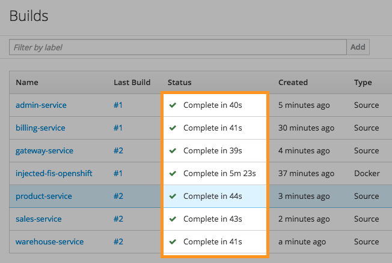

# fis2-mvn-injected-openshift

OpenShift S2I image which eager-fetches Maven dependencies for one or more [Red Hat Fuse Integration Services 2.0](https://access.redhat.com/documentation/en-us/red_hat_jboss_middleware_for_openshift/3/html/red_hat_jboss_fuse_integration_services_2.0_for_openshift/) Java/Groovy Maven projects and injects a pre-populated 'm2' artifact directory into downstream image containers to expedite builds.

### Why

In developing Proof-of-Concept projects (and often throughout the development life cycle), code iteration is inevitable both during and well beyond the point of framework/dependency selection. When working with Maven projects in [containerized solutions](https://docs.openshift.com/container-platform/3.5/architecture/core_concepts/containers_and_images.html), the build process necessitates a fetching of project dependencies with each iterative build.

Often times, especially in latter stages of development, iterations are focused on implementation code as the dependency set is well established, thus leading to a lot of time spent in fetching redundant dependency sets. In other cases, such as with microservice architectures, multiple lightweight components often share a great deal of dependencies in common and could benefit from a shareable fetch mechanism that could alleviate the need for dependency resolution with each component build.

### What

By using an intermediate [image stream](https://docs.openshift.com/container-platform/3.5/architecture/core_concepts/builds_and_image_streams.html) between the FIS 2.0 image stream and downstream images, it's possible to have the intermediate image assume the sole responsibility of fetching all needed dependencies for one or more projects and making them available to future builds.

In cases where dependencies are altered, rather than facing a lengthy build time for each potentially affected container, the intermediate image stream can be rebuilt, thereby refetching the shared dependency set one time. Following a successful fetch build, all affected downstream images will then automatically trigger a build that runs in a fraction of the usual time with the newly fetched dependency set already on hand.

In cases where dependencies are not altered but implementation code is changed, the existing dependency set offered by the intermediate image already satisfies the requirements of the new build, so the intermediate image build can be skipped, requiring only a build of downstream image which will, again, run in a fraction of the usual build time since all dependencies have already been made available.

Example build times with containers independently fetching dependencies:


Example build times utilizing intermediate dependency injection approach:


### How

An [example template](templates/fis2-mvn-injected-openshift.yaml) is provided which accepts the following parameters:

```
parameters:
- name: IS_TAG
  value: latest
- name: REGISTRY
  value: 172.30.37.138
- name: IS_PULL_NAMESPACE
  value: openshift
- name: GIT_URL
  value: https://github.com/jeremyary/fis2-ecom-services.git
```

When using the template, The *REGISTRY* and *IS_PULL_NAMESPACE* should be overridden to match your OpenShift environment. The *GIT_URL* parameter should be overridden to point to a single-module or multi-module Maven project on GitHub. The project will be cloned during the intermediate stream build so that the parent directory and any possible submodule subdirectories containing a *pom.xml* file are identified, wherein the downstream Maven command will be emulated in order to capture all needed dependencies.

Single-module Project Example:
```
ProjectName
├──  src
│   └── main
│   └──── fabric8
│   └──── java
│   └──── resources
├── pom.xml
```

Multi-module Project Example:
```
ProjectName
├──  ModuleName
│   └── src
│   └──── ...
│   └── pom.xml
├──  ModuleName
│   └── src
│   └──── ...
│   └── pom.xml
├──  ModuleName
│   └── src
│   └──── ...
│   └── pom.xml
├── pom.xml
```

Template Usage:
```
oc process -f https://raw.githubusercontent.com/jeremyary/fis2-mvn-injected-template/master/templates/fis2-mvn-injected-openshift.yaml \
    -p REGISTRY=<registry_ip> -p IS_PULL_NAMESPACE=<namespace> -p GIT_URL=<.git_project_url> | oc create -f -
```

### Components

* [Red Hat OpenShift Container Platform 3.X](https://docs.openshift.com/container-platform/3.5/welcome/index.html)
* [Red Hat Fuse Integration Services 2.0](https://access.redhat.com/documentation/en-us/red_hat_jboss_middleware_for_openshift/3/html/red_hat_jboss_fuse_integration_services_2.0_for_openshift/)
* [Maven](https://maven.apache.org/) - Dependency Management
* [Git](https://git-scm.com/) - Repository Management
* [GitHub](https://github.com/) - Repository Hosting

### Authors

* **Jeremy Ary** - *Initial work* - [jeremyary](https://github.com/jeremyary) - jary@redhat.com - jeremy.ary@gmail.com

### License

This project is licensed under the MIT License - see the [LICENSE.md](LICENSE.md) file for details

### Acknowledgments

* Red Fedora tip to [welshstew](https://github.com/welshstew/fis-groovy-openshift) for the inspiration
